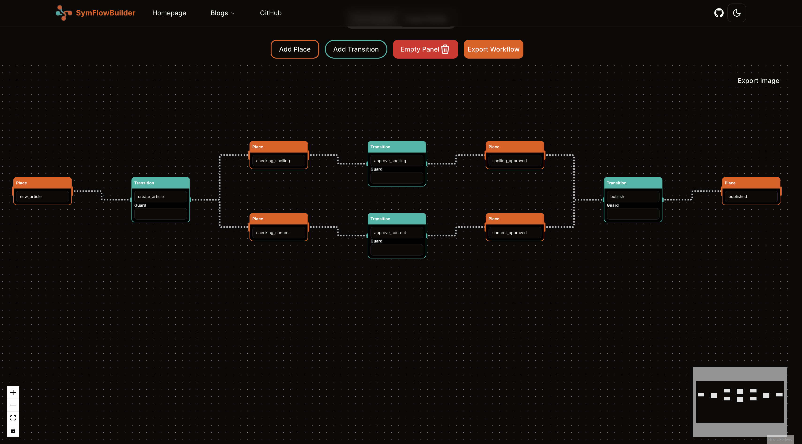
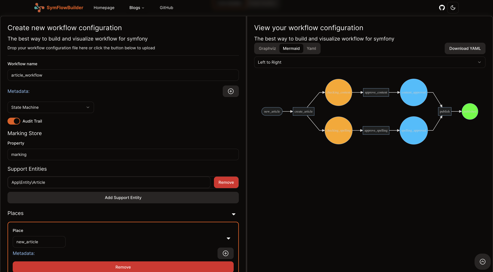
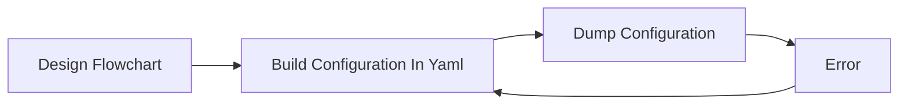
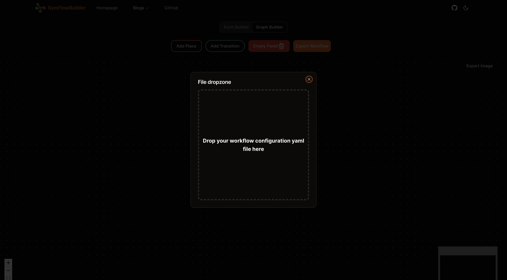

# SymFlowBuilder—The platform where symfony workflows are made easy!

## Table of Contents
- [Introduction](#introduction)
- [Why Use SymFlowBuilder?](#why-use-symflowbuilder)
- [Key Features](#key-features)
- [Technologies Used](#technologies-used)
- [Future Enhancements](#future-enhancements)

## Introduction
SymFlowBuilder is a platform that simplifies the process of designing, configuring,
and exporting workflows in Symfony applications and makes it easier for developers to manage complex workflows
and streamline their development process.
This platform provides an intuitive drag-and-drop interface that allows developers to visually map out their workflows,
define states, transitions, and attach listeners to specific events.
The platform also includes a form builder that allows users to define the form fields and their types,
which are then used to generate the form configuration for the workflow.
The platform is designed to be compatible with different Symfony versions,
ensuring that it remains relevant as Symfony evolves.

https://www.symflowbuilder.com

  
  <em>Building your workflow with ease using the drag-and-drop interface</em>

  
  <em>Building your workflow with ease using the form interface and visualize it in the graph with mermaid or graphviz</em>

## Why Use SymFlowBuilder?
* **Time-Saving**: The platform significantly reduces the time and effort required to configure workflows in Symfony projects.
* **Error Reduction**: The visual interface minimizes the chances of human error in workflow configuration.
* **Enhanced Collaboration**: The visual representation of workflows makes it easier for teams to understand and collaborate on workflow designs.
* **Streamlined Development**: The platform simplifies the process of designing, configuring, and exporting workflows, making it easier for developers to manage complex workflows.
* **Compatibility**: SymFlowBuilder is designed to be compatible with different Symfony versions, ensuring that it remains relevant as Symfony evolves.
* **User-Friendly**: The intuitive drag-and-drop interface makes it easy for developers of all levels to design and configure workflows.

In a classic Symfony application, the workflow configuration is done in a YAML file. By following this flow:

With SymFlowBuilder, the process is simplified and streamlined:

You can also import existing workflow configurations and visualize them in the platform, making it easier to understand and modify existing workflows.

  
  <em>Importing pre-existing workflow configuration files to visualize and modify them in the platform</em>

## Key Features:
This platform offers the following features which will make your task of making workflow more easily and streamline:
* **User-Friendly Interface**: The interface needed to be intuitive yet powerful enough to handle complex workflow designs. I opted for a drag-and-drop interface, allowing users to visually map out their workflows. This approach also included inline editing for defining states, transitions, and attaching listeners to specific events.
* **Ensuring Compatibility**: Symfony's Workflow component evolves,
  so ensuring compatibility with different Symfony versions was crucial.
  I implemented a modular architecture,
  allowing the core functionality
  to remain consistent while enabling easy updates for compatibility with new Symfony releases.
* **Exporting Configuration Files**:
  A key feature of the platform is its ability
  to export the designed workflow as a Symfony-compatible configuration file.
  This required developing a sophisticated backend logic that translates visual designs into YAML configuration files,
  adhering to Symfony's standards.
* **Importing Configuration Files**:
  The platform also supports importing existing workflow configuration files,
  allowing users to visualize and modify their existing workflows.
  This feature required developing a parser that can read and interpret the YAML configuration files,
  and then render the visual representation of the workflow.
* **Workflow Visualization**:
  This visualization aspect not only aids in the rapid development and troubleshooting of workflows but also facilitates better team collaboration
  by making the workflows easily understandable for everyone involved,
  regardless of their technical depth in Symfony.
* **Form Builder**:
  The platform also includes a form builder
  that allows users to define the form fields and their types,
  which are then used to generate the form configuration for the workflow.
  This feature is particularly useful for developers who are not familiar with Symfony's form configuration syntax.

## Technologies Used:
* **Next.js**: The frontend of the platform is built using Next.js,
  a React framework that provides server-side rendering and other performance optimizations.
* **Tailwind CSS**: The UI components are styled using Tailwind CSS,
  a utility-first CSS framework that allows for rapid UI development.
* **React Flow**: The drag-and-drop interface is powered by React Flow,
  a library that provides a flexible and customizable flowchart component.

## Future Enhancements:
* **User Authentication**: Implementing user authentication and user-specific workflows.
* **Workflow Versioning**: Adding support for versioning of workflows.
* **Undo/Redo Functionality**: Enabling users to undo and redo changes made to the workflow.
* **Collaboration Features**: Adding features that facilitate collaboration among team members, such as comments, annotations, and notifications.
* **Export to Other Formats**: Supporting export to other formats such as XML and JSON.
* **Possibility to link workflows to Symfony Applications**: Enabling the platform to link workflows to specific Symfony applications, allowing for seamless integration with Symfony projects and modify the workflow directly from the platform.
