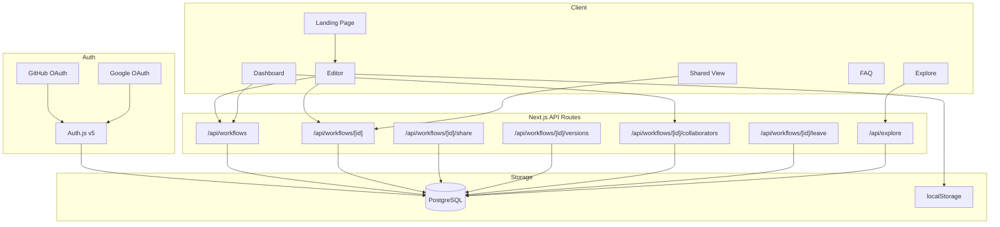
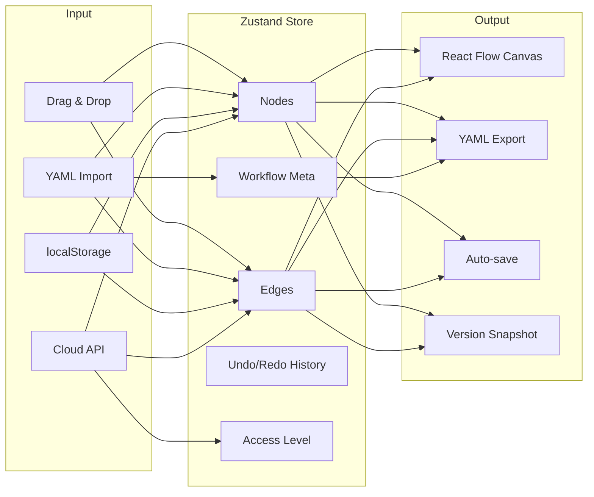
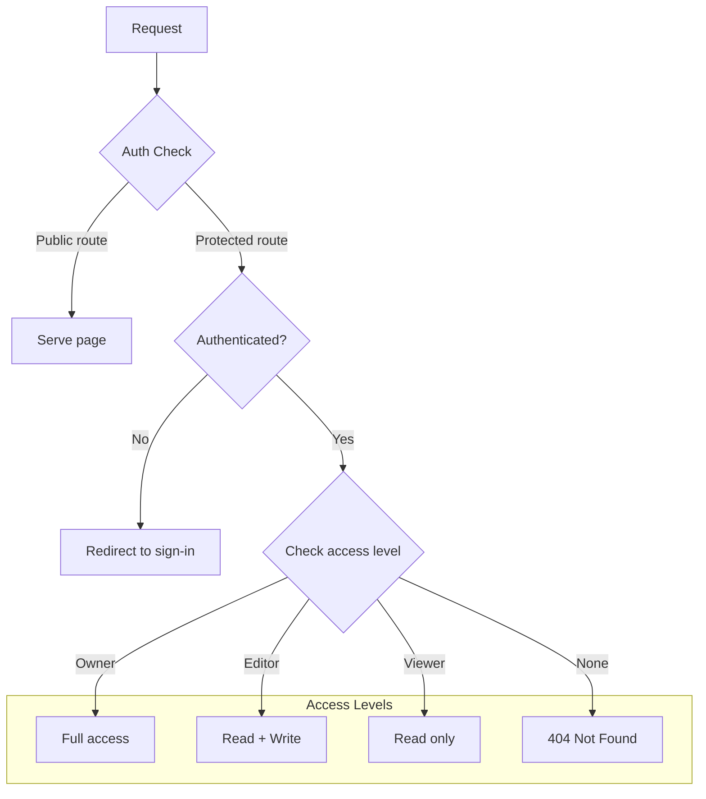
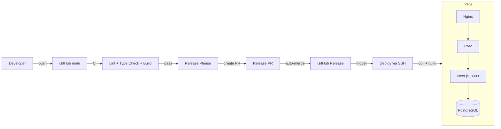

# Architecture

## System Overview

```mermaid
graph TB
    subgraph Client
        LP[Landing Page]
        ED[Editor]
        DB[Dashboard]
        EX[Explore]
        FAQ[FAQ]
        SV[Shared View]
    end

    subgraph Auth
        GH[GitHub OAuth]
        GO[Google OAuth]
        AJS[Auth.js v5]
    end

    subgraph API["Next.js API Routes"]
        WF["/api/workflows"]
        WFI["/api/workflows/[id]"]
        SH["/api/workflows/[id]/share"]
        VER["/api/workflows/[id]/versions"]
        COL["/api/workflows/[id]/collaborators"]
        LEA["/api/workflows/[id]/leave"]
        EXP["/api/explore"]
    end

    subgraph Storage
        PG[(PostgreSQL)]
        LS[localStorage]
    end

    LP --> ED
    ED --> WF
    ED --> WFI
    ED --> LS
    DB --> WF
    DB --> COL
    EX --> EXP
    SV --> WFI

    GH --> AJS
    GO --> AJS
    AJS --> PG

    WF --> PG
    WFI --> PG
    SH --> PG
    VER --> PG
    COL --> PG
    LEA --> PG
    EXP --> PG
```

## Editor Data Flow

```mermaid
flowchart LR
    subgraph Input
        DD[Drag & Drop]
        YI[YAML Import]
        LS[localStorage]
        API[Cloud API]
    end

    subgraph State["Zustand Store"]
        N[Nodes]
        E[Edges]
        M[Workflow Meta]
        H[Undo/Redo History]
        AL[Access Level]
    end

    subgraph Output
        CV[React Flow Canvas]
        YE[YAML Export]
        AS[Auto-save]
        VS[Version Snapshot]
    end

    DD --> N
    DD --> E
    YI --> N
    YI --> E
    YI --> M
    LS --> N
    LS --> E
    API --> N
    API --> E
    API --> AL

    N --> CV
    E --> CV
    N --> YE
    E --> YE
    M --> YE
    N --> AS
    E --> AS
    N --> VS
    E --> VS
```

## Authentication & Authorization Flow

```mermaid
flowchart TD
    R[Request] --> MW{Auth Check}
    MW -->|Public route| PUB[Serve page]
    MW -->|Protected route| AUTH{Authenticated?}
    AUTH -->|No| SIGN[Redirect to sign-in]
    AUTH -->|Yes| ACCESS{Check access level}
    ACCESS -->|Owner| FULL[Full access]
    ACCESS -->|Editor| EDIT[Read + Write]
    ACCESS -->|Viewer| VIEW[Read only]
    ACCESS -->|None| DENY[404 Not Found]

    subgraph "Access Levels"
        FULL
        EDIT
        VIEW
        DENY
    end
```

## Deployment

```mermaid
flowchart LR
    DEV[Developer] -->|push| GH[GitHub main]
    GH -->|CI| CI[Lint + Type Check + Build]
    CI -->|pass| RP[Release Please]
    RP -->|create PR| PR[Release PR]
    PR -->|auto-merge| REL[GitHub Release]
    REL -->|trigger| DEP[Deploy via SSH]
    DEP -->|pull + build| VPS[VPS]

    subgraph VPS
        NG[Nginx] --> PM2[PM2]
        PM2 --> NJS[Next.js :3003]
        NJS --> PG[(PostgreSQL)]
    end
```
