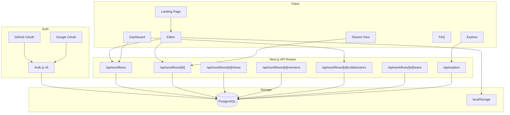
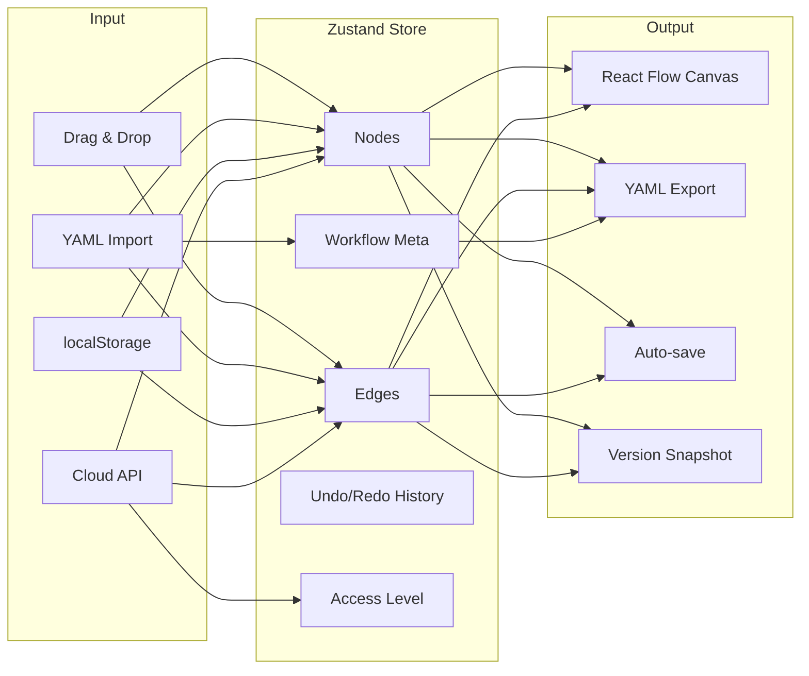
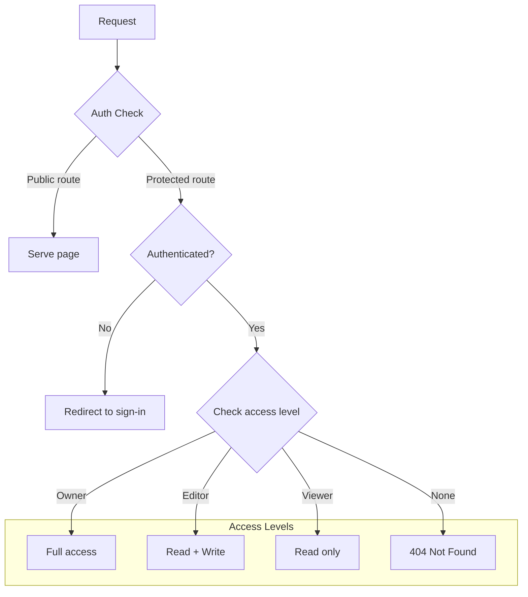
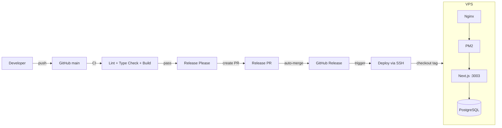

# Architecture

Technical architecture of SymFlowBuilder — a Next.js 16 application with React Flow, Zustand, Prisma, and Auth.js.

## System Overview

The application follows a standard Next.js App Router architecture with React Server Components for pages and client components for interactive features. All API routes live under `/app/api/` and use Prisma for database access.

### Key Architectural Choices

- **Public-first editor** — The `/editor` route is never behind auth. Guests use localStorage; authenticated users get cloud persistence. This maximizes adoption with zero friction.
- **Single API layer** — Next.js Route Handlers serve as the API. No separate backend service.
- **Centralized auth helper** — `lib/workflow-auth.ts` provides `getWorkflowAccess()` which returns `owner | editor | viewer | none`. Every API route uses this instead of inline ownership checks.

## Editor Data Flow

The editor is the core of the application. It uses React Flow for the canvas, Zustand for state management, and custom nodes/edges for Symfony-specific visualization.

### Zustand Store (`stores/editor.ts`)

The store holds the complete editor state: nodes, edges, workflow metadata, selection, undo/redo history, and access level. React Flow's `onNodesChange` and `onEdgesChange` handlers are wired directly to the store.

Key behaviors:

- **Undo/redo** — Snapshots are taken on every meaningful change (add/delete/move nodes, add/delete edges, property edits). Max 50 entries.
- **Auto-save** — Debounced (2s) save to cloud via `PUT /api/workflows/[id]`. Disabled for viewers.
- **Guest persistence** — `useLocalDraft` hook saves to `localStorage` as `sfb_draft_{uuid}` on every change (debounced 500ms).
- **Access level** — Set from the API response when loading a workflow. Controls whether editing and auto-save are enabled.

### Custom Nodes & Edges

| Component        | Maps to              | Visual                                                       |
| ---------------- | -------------------- | ------------------------------------------------------------ |
| `StateNode`      | Symfony "place"      | Glass card with label, initial/final badges, metadata count  |
| `TransitionEdge` | Symfony "transition" | Animated dashed line with label, guard badge, listener count |

## Authentication & Authorization

Auth.js v5 with the Prisma adapter handles OAuth (GitHub + Google). Sessions are database-backed.

### Route Protection

- `/editor` — Always public. Auth is optional.
- `/dashboard/*` — Requires authentication (checked in layout).
- `/api/workflows/*` — Uses `getWorkflowAccess()` per route.
- `/w/[shareId]` — Public if `isPublic = true`.
- `/explore` — Public. Queries only `isPublic` workflows.

### Guest-to-Auth Migration

When a guest signs in, any `sfb_draft_*` keys in localStorage are migrated to cloud storage via `POST /api/workflows` with `source: "migration"`.

## YAML Export & Import

### Export (`lib/yaml-export.ts`)

A pure function that takes `{ nodes, edges, meta }` from the Zustand store and generates valid Symfony workflow YAML. It:

- Maps React Flow nodes to Symfony `places`
- Maps React Flow edges to Symfony `transitions`
- Respects the selected Symfony version for compatibility
- Includes guards, metadata, listeners, and marking store config

### Import (`lib/yaml-import.ts`)

Parses a Symfony YAML file and produces `{ nodes, edges, meta }`. Supports both full `framework.workflows.{name}` structure and bare workflow objects. Uses `lib/layout-engine.ts` for automatic node positioning via topological sort.

## Deployment

The CI/CD pipeline uses GitHub Actions with release-please for automated versioning.

### Pipeline Details

1. **Push to main** — CI runs lint (ESLint + Prettier), type checking (TypeScript), and production build.
2. **Release Please** — After CI passes, creates or updates a release PR with changelog and version bump.
3. **Release PR auto-merges** — Via GitHub App token.
4. **Release published** — Triggers deploy workflow which SSHs to VPS, checks out the release tag, installs deps, runs migrations, builds, and restarts PM2.

### Infrastructure

| Component       | Technology                                            |
| --------------- | ----------------------------------------------------- |
| Reverse proxy   | Nginx with SSL (Let's Encrypt), HTTP/2, HTTP/3 (QUIC) |
| Process manager | PM2 in fork mode                                      |
| Database        | PostgreSQL 16                                         |
| Node.js         | v20                                                   |
| Static assets   | Served directly by Nginx with 365-day cache           |
