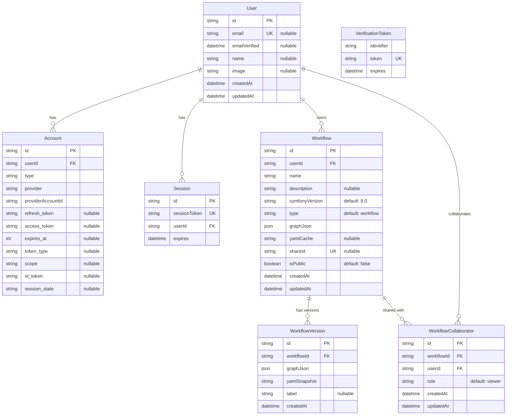

# Entity Relationship Diagram

Database schema for SymFlowBuilder.

```mermaid
erDiagram
    User {
        string id PK
        string email UK "nullable"
        datetime emailVerified "nullable"
        string name "nullable"
        string image "nullable"
        datetime createdAt
        datetime updatedAt
    }

    Account {
        string id PK
        string userId FK
        string type
        string provider
        string providerAccountId
        string refresh_token "nullable"
        string access_token "nullable"
        int expires_at "nullable"
        string token_type "nullable"
        string scope "nullable"
        string id_token "nullable"
        string session_state "nullable"
    }

    Session {
        string id PK
        string sessionToken UK
        string userId FK
        datetime expires
    }

    VerificationToken {
        string identifier
        string token UK
        datetime expires
    }

    Workflow {
        string id PK
        string userId FK
        string name
        string description "nullable"
        string symfonyVersion "default: 8.0"
        string type "default: workflow"
        json graphJson
        string yamlCache "nullable"
        string shareId UK "nullable"
        boolean isPublic "default: false"
        datetime createdAt
        datetime updatedAt
    }

    WorkflowVersion {
        string id PK
        string workflowId FK
        json graphJson
        string yamlSnapshot
        string label "nullable"
        datetime createdAt
    }

    WorkflowCollaborator {
        string id PK
        string workflowId FK
        string userId FK
        string role "default: viewer"
        datetime createdAt
        datetime updatedAt
    }

    User ||--o{ Account : "has"
    User ||--o{ Session : "has"
    User ||--o{ Workflow : "owns"
    User ||--o{ WorkflowCollaborator : "collaborates"
    Workflow ||--o{ WorkflowVersion : "has versions"
    Workflow ||--o{ WorkflowCollaborator : "shared with"
```
