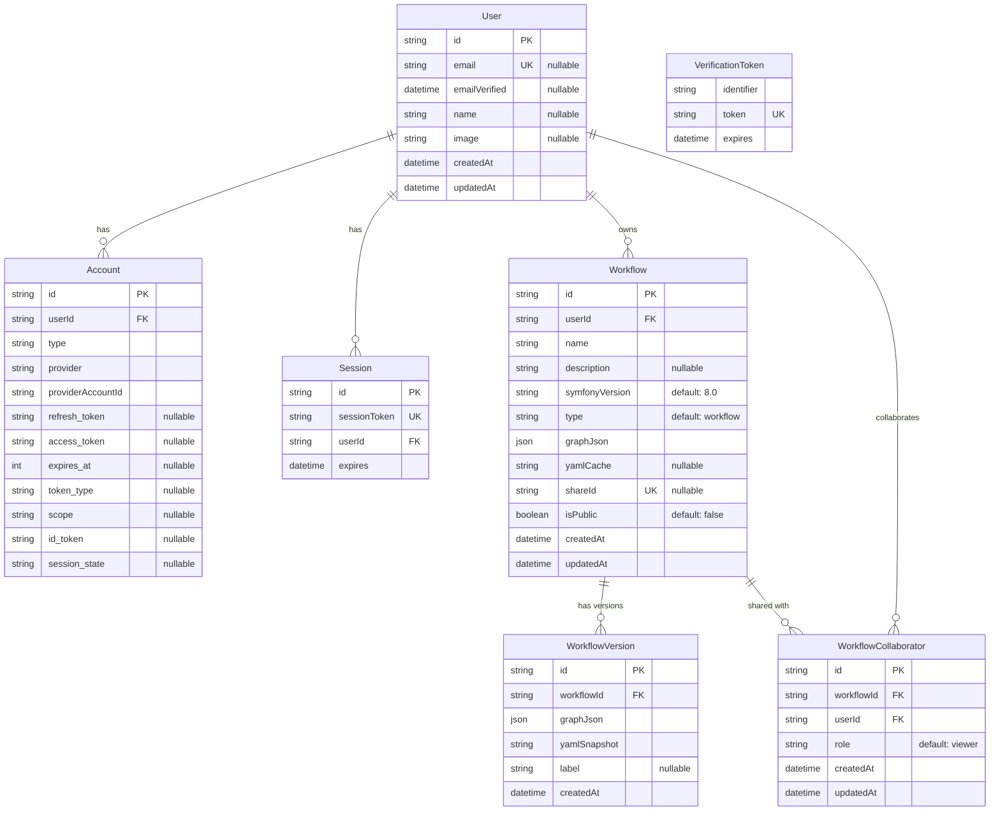

# Entity Relationship Diagram

The database schema for SymFlowBuilder, managed by [Prisma](https://www.prisma.io/) with PostgreSQL.

## Overview

SymFlowBuilder uses 6 core models:

| Model                    | Purpose                                                                        |
| ------------------------ | ------------------------------------------------------------------------------ |
| **User**                 | Authenticated users (via GitHub or Google OAuth)                               |
| **Account**              | OAuth provider connections (a user can link multiple providers)                |
| **Session**              | Active login sessions managed by Auth.js                                       |
| **Workflow**             | A user's workflow design — stores the React Flow graph as JSON and cached YAML |
| **WorkflowVersion**      | Point-in-time snapshots of a workflow for version history                      |
| **WorkflowCollaborator** | Grants other users viewer or editor access to a workflow                       |

## Key Design Decisions

- **`graphJson` (Json)** — The entire React Flow graph (nodes, edges, metadata) is stored as a single JSON column. This avoids complex relational modeling for graph data and makes load/save a single read/write.
- **`shareId` (unique, nullable)** — When set, the workflow is accessible via `/w/{shareId}`. Setting it to `null` makes the workflow private again.
- **`WorkflowCollaborator` uses a composite unique constraint** `(workflowId, userId)` to prevent duplicate invitations, and an index on `userId` for fast "shared with me" dashboard queries.
- **`onDelete: Cascade`** on all foreign keys — deleting a user removes their workflows, sessions, and collaborator records. Deleting a workflow removes its versions and collaborators.
- **Auth.js models** (`Account`, `Session`, `VerificationToken`) follow the [Auth.js Prisma adapter schema](https://authjs.dev/getting-started/adapters/prisma).

## Diagram

## Access Model

A workflow has four access levels, determined by `lib/workflow-auth.ts`:

| Level      | Who                                                         | Can view | Can edit | Can delete | Can manage collaborators |
| ---------- | ----------------------------------------------------------- | -------- | -------- | ---------- | ------------------------ |
| **owner**  | `workflow.userId` matches                                   | Yes      | Yes      | Yes        | Yes                      |
| **editor** | `WorkflowCollaborator.role = "editor"`                      | Yes      | Yes      | No         | No                       |
| **viewer** | `WorkflowCollaborator.role = "viewer"` or `isPublic = true` | Yes      | No       | No         | No                       |
| **none**   | Everyone else                                               | No       | No       | No         | No                       |
